# video-ad-
---
AI-powered analysis and recommendations engine for video ad creatives — Klike Data Science Challenge
---
## Como rodar

### Pré-requisitos
- Python 3.10+
- pip

### Instalação

Clone o repositório e instale as dependências:
```bash
git clone <url-do-repositorio>
cd <nome-do-repositorio>
pip install -r requirements.txt
```

### Execução

Abra os notebooks na ordem:
1. `01_eda.ipynb` — Análise Exploratória
2. `02_modelagem.ipynb` — Feature Engineering e Modelo
3. `03_recomendacoes.ipynb` — Engine de Recomendações
```bash
jupyter notebook
```

> As bibliotecas principais utilizadas foram `xgboost`, `scikit-learn`, `lightgbm`, `shap`, `dice_ml`, `pandas`, `matplotlib` e `seaborn`.
---
## EDA

### Visão geral dos dados
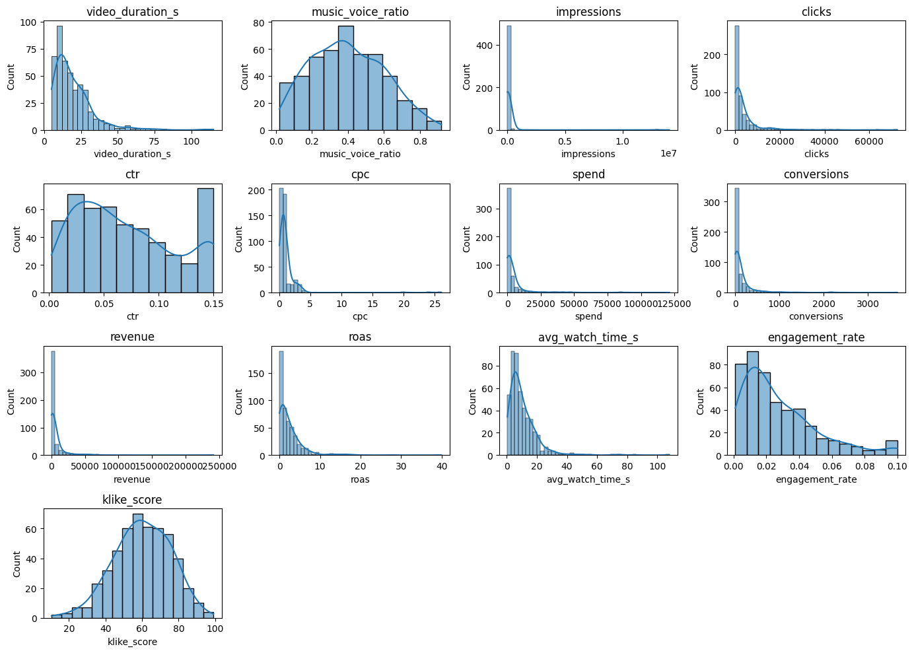
 Como observado na figura acima, **` klike_score `**, **` musice_voice_ratio `**, **` ctr `**, **` engagement_rate `** são atributos com distribuição apoximadamente normais:
 * Possuem curva em sino
 * KDE bem centralizado
 * Simétrico
  As features **` impressions `**, **` clicks `**, **` spend `**, **` conversions `**, **` revenue `**, **` roas `**, **` avg_watch_time_s `**,**` cpc `**, **`video_duration_s`** possuem uma distribuição fortemente assimétrica, o que indica presença de outliers por ter muitos valores pequenos e poucos valores grandes ( Diferença em escala causando assimetria ). Mas é importante avaliar se esses Outliers são naturais ou não e eles devem ser completamente eliminados ou se eles expõem a distribuição natural do contexto.

  I
  Isso significa que poucos vídeos performam muito ( o que é comum em plataformas digitais ).
---
### Valores faltantes
 Após analisar o dataset fornecido, foi possível identificar atributos com valores faltantes, sendo eles
 * **`has_subtitle`** (9.2%)
 * **`music_voice_ratio`** (7.6%)
 * **`cpc`** (5.6%)
 * **`revenue`** (5.0%)
 * **`avg_watch_time_s`** (5.4%)
 * **`engagement_rate`** (6.4%)
 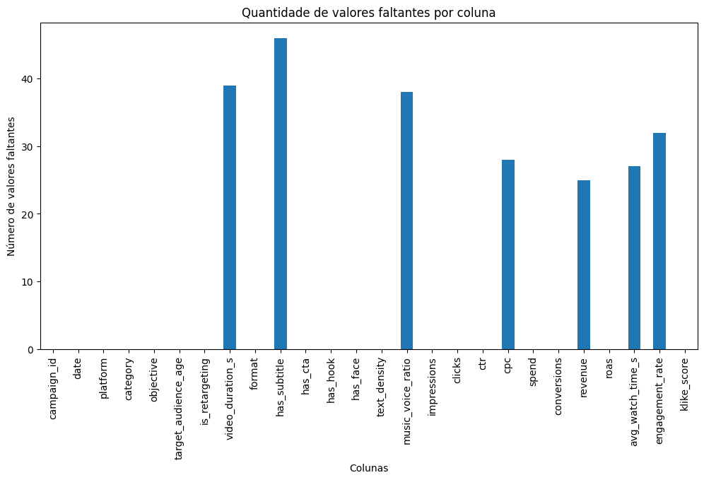
 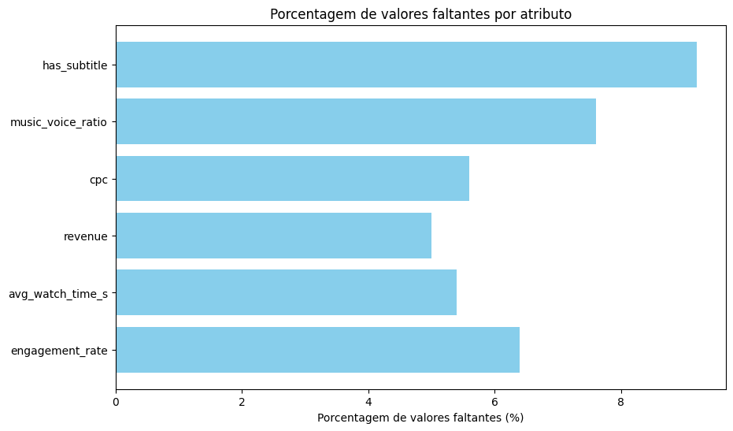

 Os números sugerem que os valores faltantes não estão ligados à problemas generalizados na coleta dos dados. Entretanto algumas colunas podem ter padrões específicos de ausências, sendo necessário mais análises, como checar se os valores faltantes estão relacionados a uma plataforma ou grupo específico de vídeos ou campanhas.
---
### Escala nos atributos
 Dado o contexto da aplicação, é natural que alguns atributos apresentem uma variação maior em sua escala de valores. Ao analisar os dados, é possível destacar essas características.
 * **`impressions`**
 * **`revenue`**
 * **`spend`**
 * **`clicks`**
 * **`conversions`**
 * **`video_duration_s`**
 * **`music_voice_ratio`**
 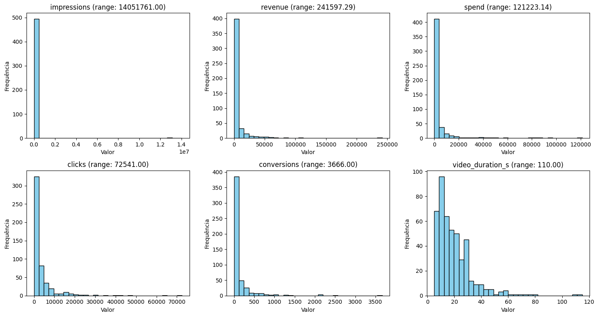
 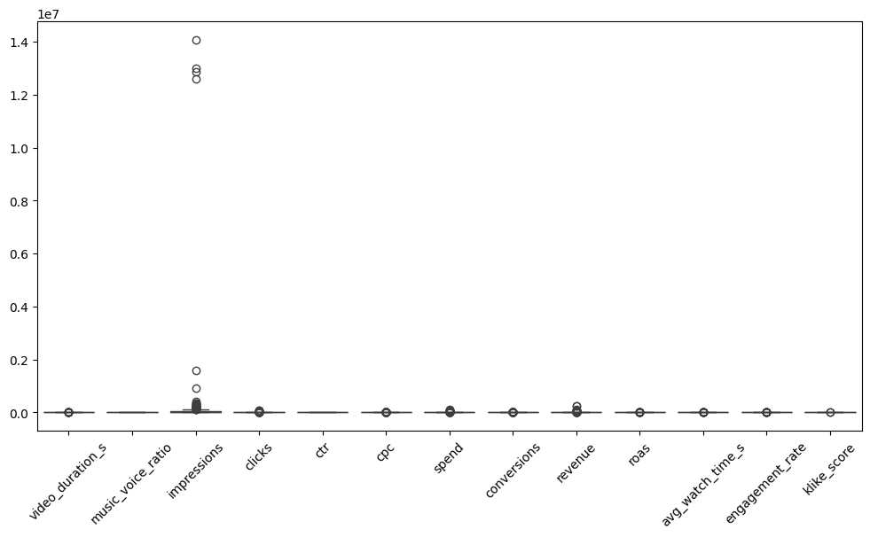

  Valores extremos positivos nem sempre indicam a presença de ruídos nos dados, uma vez que vídeos virais podem gerar milhares de impressões, enquanto outros podem apresentar valores limitados a poucas unidades. à magnitude dos valores.
  Diversos modelos de machine learning são sensíveis a essas diferenças de escala, podendo apresentar problemas durante o treinamento, pois muitas métricas e algoritmos, como regressão linear, redes neurais e até o cálculo de correlação, dependem diretamente da magnitude dos valores.
  Assim, é recomendado aplicar normalização ou padronização nos atributos, de forma a reduzir o impacto dos valores extremos e permitir que o modelo aprenda de forma mais equilibrada sem que atributos de maior magnitude dominem a influência.
  Embora métodos baseados em árvores, como o XGBoost, sejam naturalmente robustos à escala dos atributos, tais transformações foram consideradas com o objetivo de melhorar a interpretabilidade estatística, a estabilidade numérica e a comparabilidade entre diferentes métricas analisadas.
---
### Tratamento de dados Faltantes
- **`has_subtitle`** :apresenta 46 nulos (~9% do conjunto de dados) distribuídos proporcionalmente entre plataformas. Com isto, pode-se inferir que não é problema com coleta de dados em alguma plataforma específica, onde a ausência dos valores pode significar que a informação não foi registrada e a ausência do registro sugere que o atributo não estava presente. Preenchidos com **`False`**, assumindo ausência de legenda.
- Para os atributos **`video_duration_s`**, **`cpc`**, **`revenue`**, **`avg_watch_time_s`** e **`engagement_rate`** primeiramente foi avaliado a porcentagem de dados faltantes, como ela é baixa, não justifica a remoção das categorias. Com isto, o preenchimento dos dados por média ou mediana se apresentam como melhor estratégia, para isso, foi utilizado a medida de assimetria ou **skewness** de cada coluna, onde |**skewness**| > 1 representa uma distribuição assimétrica, o que caracteriza o preenchimento por mediana, pois nesse caso a média seria uma medida enganosa. Já |**skewness**| < 1 representa uma distribuição simétrica, apontando o cenário de preenchimento por média. Por outro lado, **`music_voice_ratio`** apresenta um **skewness** < 1, sendo assim é recomendado aplicar a média

---
### Tratamento de Outliers
 Outliers têm como definição valores extremos ligados aos dados, sejam eles muito grandes ou muito pequenos. No entanto, nem sempre a presença de outlier significa que o registro deve ser removido. Existem atributos que naturalmente podem conter valores extremos, principalmente quando se fala de caraterísticas inseridas no contexto de redes sociais, como impressões, quantidade de cliques, valor gasto e receita gerada.
- **`impressions`**, **`clicks`**, **`spend`**, **`revenue`** e **`conversions`**: são metricas que indicam a "quantidade de algo" que crescem muito, onde seus valores podem assumir várias ordens de magnitude. Para definir a estratégia a ser utilizada, foram avaliadas 3 estratégias: 
  * Escalonador MinMax sem log: normaliza os dados sem alterar a escala original.
  * Log seguido de MinMax: aplica log1p antes da normalização, comprimindo a escala e reduzindo a influência de valores muito altos.
  * RobustScaler: normaliza os dados usando estatísticas robustas (mediana e IQR), menos sensíveis a outliers.Escalonador MinMax sem utilização da converção do log para normalizar os dados, o uso do log antes de escalonar e o RobustScaler.
 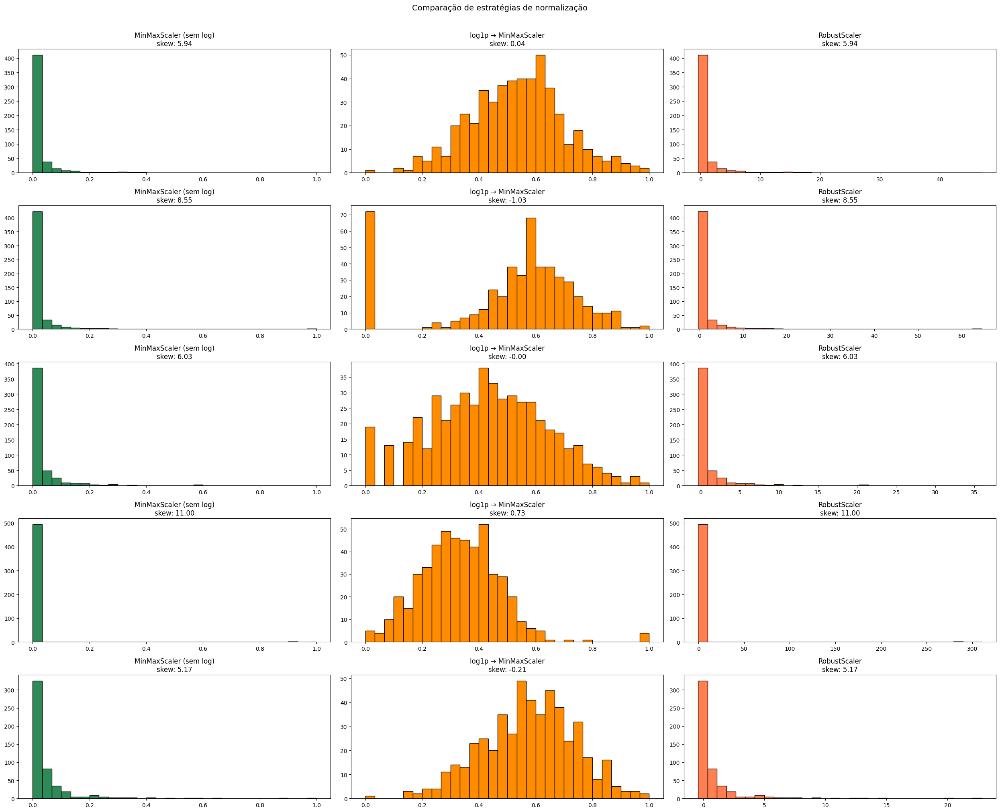
  Observa-se que a estratégia que torna os dados mais simétricos e distribuidos é o log seguido de MinMax.
  Portanto, como o objetivo final é aplicar modelos de regressão, recomenda-se:
  * Aplicar log1p para comprimir a escala da variável, mantendo sua ordem relativa e reduzindo o impacto de valores extremos nas análises, estatísticas como média e correlação, e nos modelos.
  * Em seguida, aplicar o MinMaxScaler, que transforma todos os valores para a faixa entre 0 e 1. O escalonamento só deve ser feito após o log, pois valores muito grandes poderiam comprimir demais os valores pequenos se o MinMax fosse aplicado diretamente.
 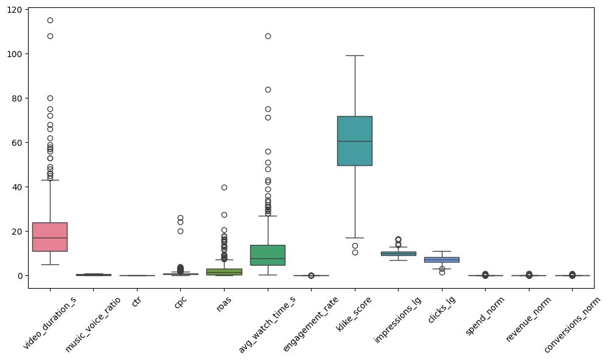

---
### Relação atributo criativo x atributo performance
Com o objetivo de entender quais características do criativo estão associadas ao desempenho das campanhas, foi realizada uma análise de correlação entre atributos do vídeo e métricas de performance.
Foram considerados como atributos criativos elementos diretamente relacionados à construção do anúncio, como presença de *hook*, legenda, CTA, rosto humano, densidade de texto, duração do vídeo e proporção entre música e voz, esses atributos foram comparados com métricas de performance relevantes, incluindo CTR, engajamento, conversões, tempo médio assistido e o `klike_score`, métrica alvo do desafio.

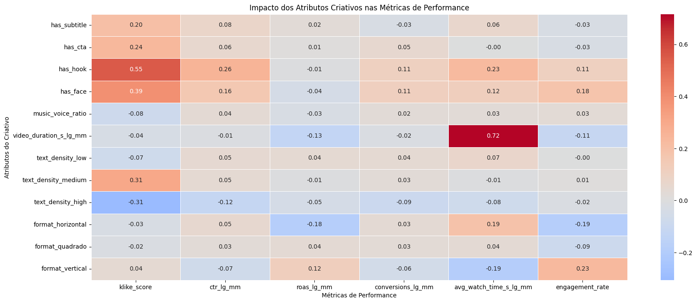

* Observa-se que a presença de *hook* apresenta a maior associação positiva com o `klike_score`, sugerindo que capturar a atenção do usuário nos primeiros segundos do vídeo pode ser um fator relevante para o desempenho geral do anúncio.
* A presença de rostos humanos também demonstra correlação positiva moderada com métricas de performance, indicando possível aumento de conexão emocional e retenção do público.
* A duração do vídeo apresenta forte correlação com o tempo médio assistido, comportamento esperado, já que conteúdos mais longos tendem a permitir maior tempo de visualização absoluta.
* Anúncios em formato horizontal tendem a ter mais tempo de visualização absoluta, já o vertical impacta negativamente na métrica, mas tem um impacto maior nos índices de engajamento.
* Por outro lado, criativos com alta densidade de texto apresentam correlação negativa com o `klike_score`, sugerindo que excesso de informação visual pode reduzir a efetividade do anúncio em ambientes de consumo rápido, como plataformas sociais.

A análise de correlação não estabelece causalidade, mas permite identificar padrões iniciais que auxiliam na compreensão do comportamento dos usuários e na definição de hipóteses para modelagem preditiva e recomendações criativas.
---
### Comportamento x plataforma
Foram considerados como atributos criativos elementos diretamente relacionados à construção do anúncio, como presença de *hook*, legenda, CTA, rosto humano, densidade de texto, duração do vídeo e proporção entre música e voz,essas features foram comparadas com métricas de performance relevantes, incluindo CTR, engajamento, conversões, tempo médio assistido e o `klike_score`, métrica alvo do desafio.
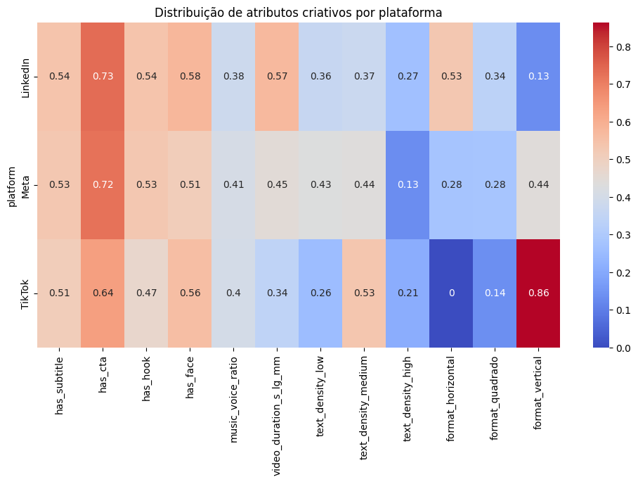
As correlações entre os entre os atributos criativos apresentam algumas semelhanças e diferenças para a criação de conteúdo para cada plataforma. Como semelhança, podemos destacar a preferência pela presença de rosto nos anúncios, um hook aos primeiros segundos, a presença de cta, legendas e uma proporção entre fala e música equilibrada. Entretanto, as plataformas também demonstram suas particularidades:
 **`TikTok`** apresenta preferência por vídeos no formato vertical, com baixa duração e densidade de texto equilibrada.
 **`Meta`** apresenta um equilíbrio entre baixa e média presença de textos, preferencialmente em formato vertical.
 **`LinkedIn`** apresenta preferência por vídeos em formato vertical e com duração maior que os outros.
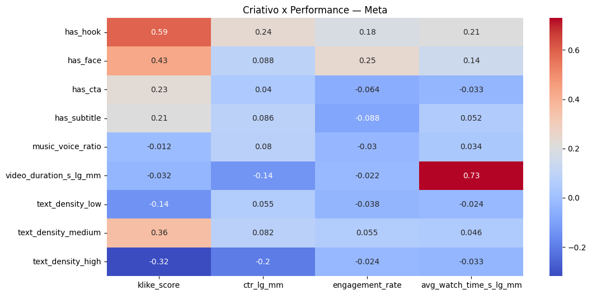

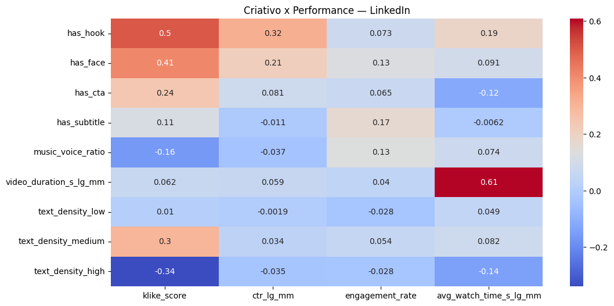
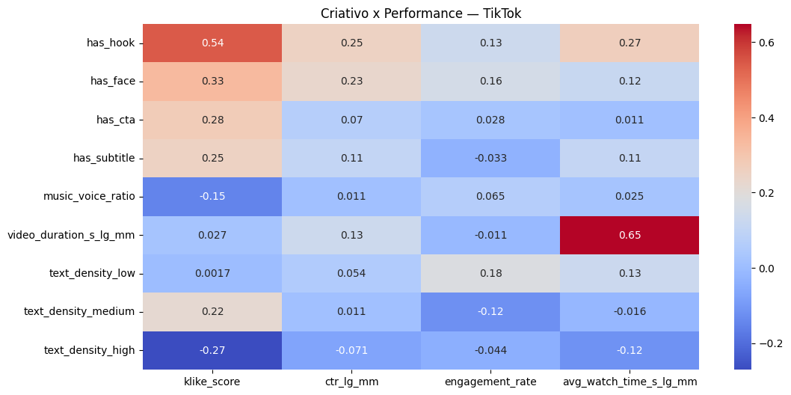

  De forma geral, os resultados indicam que o que funciona em uma plataforma não necessariamente funciona em outra — e que cada canal possui sensibilidades distintas a determinados elementos criativos.
  O atributo has_hook é o que apresenta correlação positiva mais consistente com o klike_score nas três plataformas (Meta: 0.59, TikTok: 0.54, LinkedIn: 0.50), sugerindo que iniciar o vídeo com um elemento de atenção é uma prática universalmente eficaz. Da mesma forma, a presença de rosto humano (has_face) e de CTA (has_cta) contribuem positivamente para o score em todos os canais, embora com magnitudes diferentes.
  Por outro lado, a densidade de texto alta (text_density_high) é consistentemente prejudicial ao klike_score nas três plataformas (LinkedIn: -0.34, Meta: -0.32, TikTok: -0.27), reforçando que anúncios sobrecarregados visualmente tendem a underperformar independentemente do canal.
  As diferenças entre plataformas ficam mais evidentes ao observar métricas específicas:

  No LinkedIn, a duração do vídeo (video_duration_s_lg_mm) tem correlação forte com o tempo médio assistido (0.61), indicando que o público dessa plataforma tolera — e consome — conteúdos mais longos.
  No Meta, essa mesma variável apresenta a maior correlação com avg_watch_time_s_lg_mm entre todas as plataformas (0.73), mas correlação negativa com CTR (-0.14), sugerindo que vídeos mais longos prendem a atenção mas reduzem o clique.
  No TikTok, vídeos mais longos também aumentam o tempo assistido (0.65), porém o formato e o ritmo do conteúdo parecem ser mais determinantes para engajamento do que a duração em si.
---
### Visualizações Marketing

 **Ranking de impacto por plataforma: mostra lado a lado quais atributos ajudam ou prejudicam o klike_score em cada canal.**
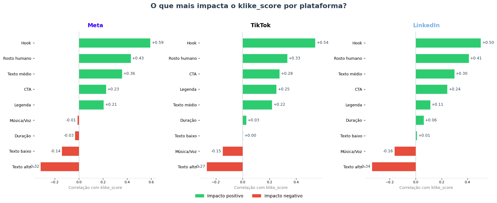

 **Radar do perfil criativo ideal: compara visualmente o "receituário" de cada plataforma**
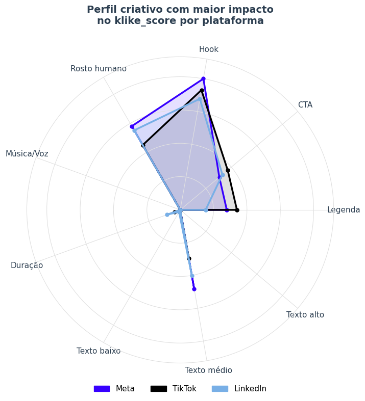

**Universal vs. específico: o que funciona em todos os canais (hook, rosto, CTA) vs. o que muda dependendo da plataforma**
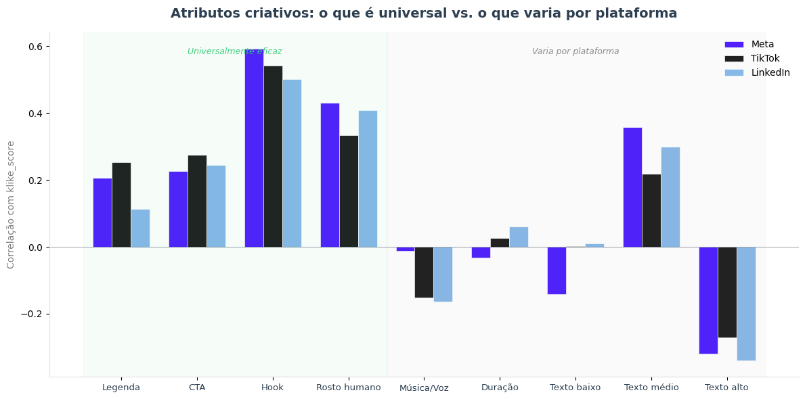

---

---
## Modelagem

### Feature Engineering
 Com o objetivo de enriquecer o dataset e capturar padrões relevantes para a predição do **`klike_score`**, foram criadas novas features a partir das variáveis originais, organizadas em grupos:

 **Features temporais**
 A coluna **`date`** em seu formato puro não representa informação útil para modelos. Entretanto, é possível derivar atributos com maior poder explicativo:
 * **`dia_da_semana`**: dia da semana da veiculação (0 = segunda).
 * **`fl_final_semana`**: flag indicando se o anúncio foi veiculado em um final de semana.
 * **`posicao_mes_veiculacao`**: divide o mês em quartis (início, meio1, meio2, fim), capturando possíveis padrões de sazonalidade intra-mensal nas campanhas.

 **Interações estratégicas**
 Combinações entre plataforma, objetivo e período foram criadas para capturar comportamentos específicos de cada contexto de veiculação:
 * **`objective_platform`**: cruzamento entre objetivo da campanha e plataforma.
 * **`platform_weekend`**: combinação entre plataforma e flag de final de semana.
 * **`obj_mes`**: cruzamento entre objetivo e posição no mês.
 * **`duration_obj`**: combinação entre categoria de duração do vídeo e objetivo, capturando se determinada duração é mais adequada para awareness, conversão, etc.

 **Features de eficiência de performance**
 Métricas derivadas que buscam capturar a eficiência do anúncio de formas que as variáveis brutas isoladas não conseguem:
 * **`porcentagem_assistida`**: razão entre tempo médio assistido e duração do vídeo — quanto do conteúdo o usuário realmente consumiu.
 * **`fl_replay`**: flag que identifica quando o tempo médio assistido supera a duração do vídeo, indicando possível replay.
 * **`receita_x_click`**: receita gerada por clique, proxy de qualidade do tráfego.
 * **`custo_x_conversao`**: custo por conversão, medida de eficiência de gasto.
 * **`ctr_x_roas`**: produto entre CTR e ROAS, combinando taxa de clique com retorno sobre o investimento.
 * **`engagement_rate_x_ctr`**: interação entre engajamento e clique, capturando anúncios que geram tanto atenção quanto ação.

 **Features do criativo**
 * **`completude_criativa`**: soma de **`has_subtitle`**, **`has_cta`**, **`has_hook`** e **`has_face`** — varia de 0 a 4, medindo o quão completo é o criativo em boas práticas.
 * **`text_density_cat`**: mapeamento ordinal da densidade de texto (low=0, medium=1, high=2).
 * **`target_audience_age_cat`**: mapeamento ordinal da faixa etária do público-alvo.

 **Interações plataforma × criativo**
 A análise de comportamento por plataforma evidenciou que o efeito de alguns atributos criativos varia dependendo do canal. Com isso, foram criadas interações específicas:
 * **`has_hook_Meta`**: interação entre presença de hook e plataforma Meta.
 * **`has_face_TikTok`**: interação entre presença de rosto e TikTok.
 * **`text_density_horizontal_Meta`**: interação tripla entre alta densidade de texto, formato horizontal e plataforma Meta — combinação que mostrou padrão negativo na EDA.

---
### Modelo
 O modelo escolhido para predição do **`klike_score`** foi o **XGBRegressor** (XGBoost). Modelos baseados em árvores com boosting são naturalmente robustos a outliers e não exigem que os dados sejam normalizados — o que é relevante dado o perfil assimétrico de diversas features do dataset. Além disso, lidam bem com interações não-lineares entre variáveis e oferecem feature importance nativa, facilitando a interpretação dos resultados sob perspectiva de negócio.

 Os hiperparâmetros utilizados foram:
 * **`n_estimators`**: 300
 * **`max_depth`**: 6
 * **`learning_rate`**: 0.05
 * **`objective`**: reg:absoluteerror — mais robusto a outliers do que o MSE padrão, alinhando a função de perda ao MAE reportado na avaliação.

---
### Avaliação
 O modelo foi avaliado em um conjunto de teste com 30% dos dados (`random_state=42`), obtendo os seguintes resultados:
 * **RMSE**: 7.03
 * **MAE**: 5.55
 * **R²**: 0.78

 O R² de **0.78** indica que o modelo explica aproximadamente 78% da variância do **`klike_score`**, um resultado sólido considerando que parte do score depende de fatores subjetivos e contextuais não capturados pelas features disponíveis. O MAE de **5.55** significa que, em média, o modelo erra em torno de 5,5 pontos no score. O RMSE levemente superior ao MAE (7.03 vs 5.55) indica a presença de alguns erros maiores em casos específicos, o que é esperado em distribuições com exemplos de alta performance que são naturalmente mais difíceis de prever.

---
### Feature Importance
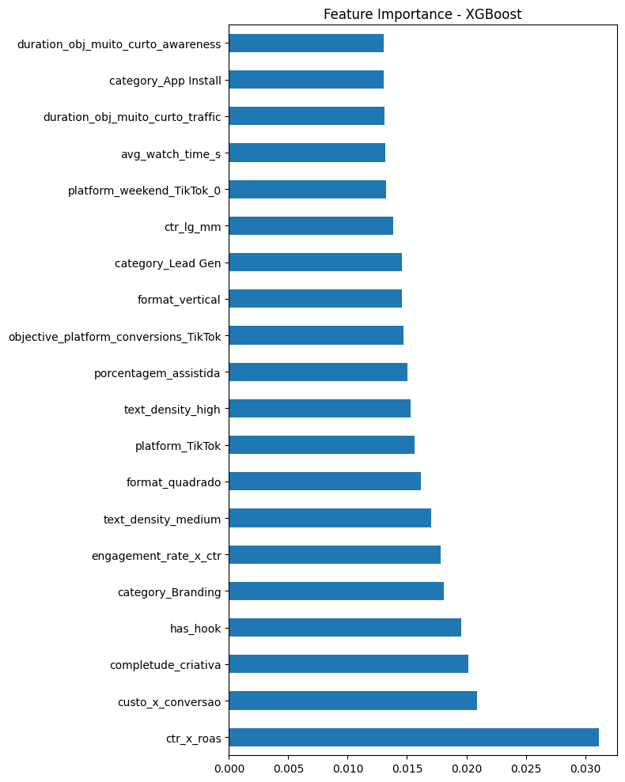
 As features de maior importância identificadas pelo modelo foram:
 * **`ctr_x_roas`** (0.030): a feature mais importante do modelo, combinando taxa de clique e retorno sobre investimento — anúncios que geram clique e convertem em receita são os que mais explicam o score.
 * **`custo_x_conversao`** (0.021): eficiência de gasto por conversão, reforçando que o modelo valoriza a relação entre investimento e resultado.
 * **`completude_criativa`** (0.021): anúncios com mais elementos de boas práticas combinados (hook + legenda + CTA + rosto) tendem a performar melhor do que os que apostam em apenas um elemento isolado.
 * **`has_hook`** (0.020): consistente com a análise de correlação da EDA, onde o hook apresentou a maior associação positiva com o **`klike_score`** nas três plataformas (Meta: 0.59, TikTok: 0.54, LinkedIn: 0.50).
 * **`category_Branding`** e **`engagement_rate_x_ctr`** (0.019): categoria da campanha e a interação entre engajamento e clique também aparecem com relevância similar.

 Esse resultado faz sentido do ponto de vista de negócio: o **`klike_score`** é em essência uma síntese do desempenho do anúncio, portanto métricas que capturam eficiência de gasto e retorno (**`ctr_x_roas`**, **`custo_x_conversao`**) são naturalmente as preditoras mais fortes. Entre os atributos criativos puros, o **`has_hook`** e a **`completude_criativa`** se destacam, reforçando que capturar atenção nos primeiros segundos e combinar múltiplos elementos criativos são as práticas com maior impacto no desempenho dos anúncios.

---
## Visão de Produto

### Se você tivesse acesso ao vídeo original (não só metadados), que features adicionais você extrairia para melhorar o modelo e as recomendações?
- Extrairia não só se há rosto, mas também a expressão emocional predominante e o tempo de tela do rosto
- A detecção da quantidade e frequência de cortes, se há elementos como zoom em momentos dramáticos para trazer tensão e reter o usuário
- O que tem no texto importa muito mais do que só a sua intensidade, poderia verificar a presença de perguntas por exemplo, por meio de detecção de pontuação.

### Como você colocaria o seu Recommendations Engine em produção? Pense em arquitetura, escalabilidade e como ele se integraria a um produto real.

A arquitetura seria dividida em 3 camadas:
- **Camada de inferência**: API REST que recebe os atributos de uma campanha e retorna as recomendações. O modelo ficaria serializado (PICKLE) e carregado em memória.
- **Camada de dados e features**: pipeline de feature engineering reproduzível (usando Feast ou Hopsworks como feature store), eliminando training/serving skew. As features são calculadas offline (batch) e armazenadas para consulta em tempo real.
- **Camada de aprendizado contínuo**: o que funciona no TikTok em janeiro pode não funcionar em junho. Por isso, o pipeline de retreinamento seria automatizado (semanal ou quinzenal) com novos dados de performance, com gates de qualidade antes de promover um novo modelo para produção.

**Integração com o produto**
- O engine se integraria como um microserviço chamado assincronamente quando um usuário analisa um criativo na plataforma. As recomendações seriam exibidas em formato "cards de ação" priorizados, cada um com o impacto estimado e o contexto que gerou aquela recomendação (ex: "com base em 47 campanhas similares no TikTok com público 25-34").

**Escalabilidade**
- Para grandes volumes, o processamento pesado (análise de vídeo, se implementado) ficaria em uma fila assíncrona (Celery + Redis ou SQS), desacoplado da API de resposta síncrona. O usuário receberia as recomendações de metadados imediatamente e as de análise visual em alguns segundos.

**Observabilidade**
- Performance técnica: latência e taxa de erro
- Performance do modelo: distribuição do klike_score predito ao longo do tempo (drift detection)
- Impacto de negócio: taxa de adoção das recomendações e correlação com melhora real nas métricas da campanha após aplicar as sugestões

### O que mais você faria se tivesse mais tempo? Que análises, experimentos ou melhorias no engine ficaram de fora?

**Análises**
- Análise mais aprofundada na coluna `date`, a fim de extrair informações como: há degradação de performance ao longo do tempo de veiculação do mesmo criativo?
- Análise mais criteriosa nas interações entre features
- Clustering de criativos: agrupar os 500 registros em perfis (ex: "criativo de performance agressiva", "criativo de brand awareness suave") e analisar o que funciona dentro de cada perfil seria mais útil do que recomendações genéricas

**Melhorias no engine de recomendações**
- Recomendações contrafactuais: em vez de só dizer "adicione um hook", mostrar criativos reais do dataset que são similares ao input mas têm hook e performam melhor — tornando a recomendação mais concreta e crível

**No modelo**
- Explorar modelos de boosting com tuning mais rigoroso
- Quantificar incerteza nas predições (intervalos de confiança)


  
---
